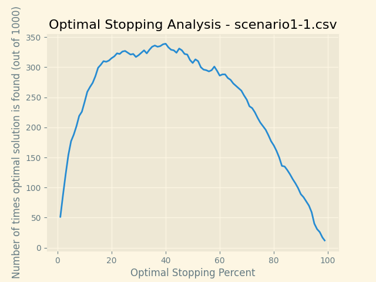
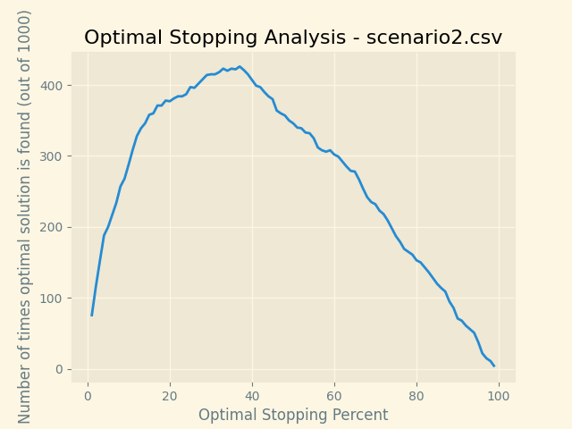
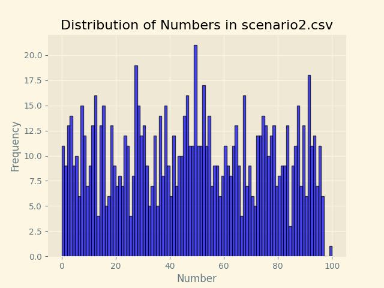
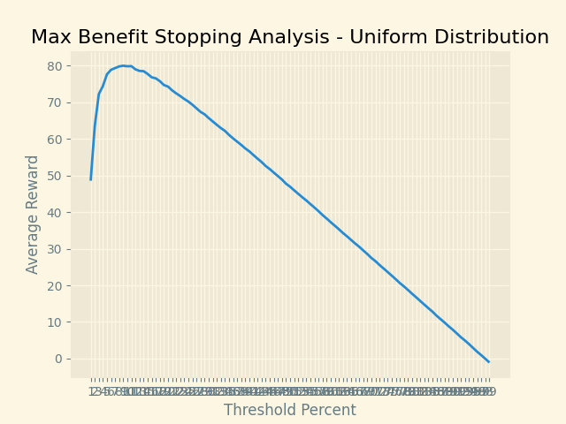
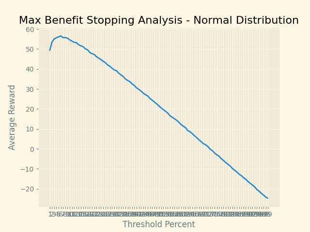

__Code Guide for Running Algorithm__
 
Open main.py in the IDE of your choice. Navigate to main.py, and hit the run button. You will need to have scenario1-1.csv and scenario2.csv in your working directory.This will run the algorithm with scenario1-1.csv and scenario2.csv. In order to
see the associated graphs in this README.md, move OptStop-scenario1-1.png, OptStop-scenario2.png, distribution.png, Uniform.png, and Normal.png into the working directory.
 
 
If you would like to run the algorithm with your own csv files, navigate to main.py and do COMMAND + F. Search for 'scenario1-1.csv'. 
Replace 'scenario1-1.csv' with the name of the csv file you would like to test in all places it appears. The plots will pop up as the
program runs. To see the next plot, exit out of the current plot and the next plot will appear.
 
 
 

__Part 1: Finding a General Optimum (No look-back)__

Below is a typical output of my algorithm on scenario1-1.csv:

 
For scenario1-1.csv, the optimal stopping point is right around 37% of the size of the data set. This can be seen in the above graph. As the stopping point
moves past this point of 37%, the number of times the optimal solution is found decreases. 
 
 
 

Below is a typical output my algorithm on scenario2.csv:

 
For scenario2.csv, the optimal stopping point seems to hover slightly below 37% or right at 37%. This can be seen in the above graph. Although not necessary, I was curious about the
distribution of data in this dataset. To further analyze the dataset I made the following histogram:

 
It is interesting to note that the distribution is not uniform. In fact, the likelihood of getting 99 or 100 is slim to none.
 
 
 
 

__Part 2: Max Benefit Stopping__

Below is a typical output of my max benefit stopping algorithm on a uniform distribution(Uniform(1,99)):

 
The optimal threshold for stopping is right around 8 percent of the size of your data set when dealing when a uniform distribution.
After this 8% point, the benefit of exploring the next option does not outweigh the probability of finding a bigger number. This is clearly shown in
the above graph. We see that the average reward is highest(about 80/100) by stopping at the threshold percent of 8%. As your stopping point moves
further past this point, your average reward will decrease.
 
 
 

Below is a typical output of my max benefit stopping algorithm on a normal distribution(Normal(mean=50, std_dev=10)):

 
The optimal threshold for stopping is right around 6 percent of the size of your data set when dealing when a normal distribution.
Once you get past this 6% point, the benefit of exploring the next option does not outweigh the probability of finding a bigger number. This is clearly shown in
the above graph. We see that the average reward is highest(about 56/100) by stopping at the threshold percent of 6%. As you move further
past this point, your average reward will decrease. 