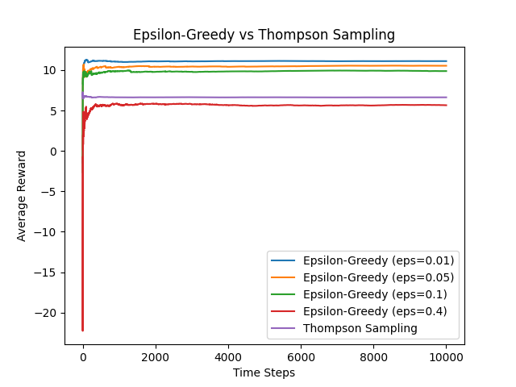
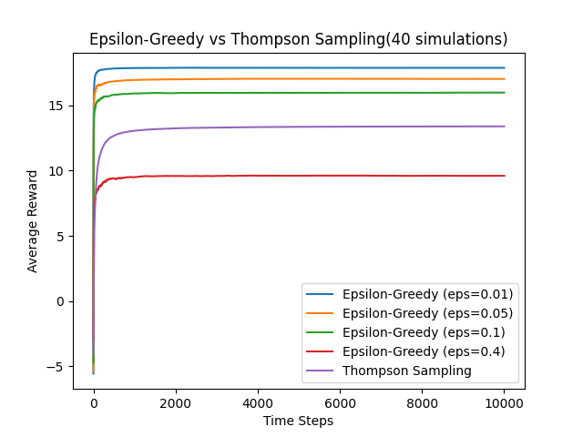
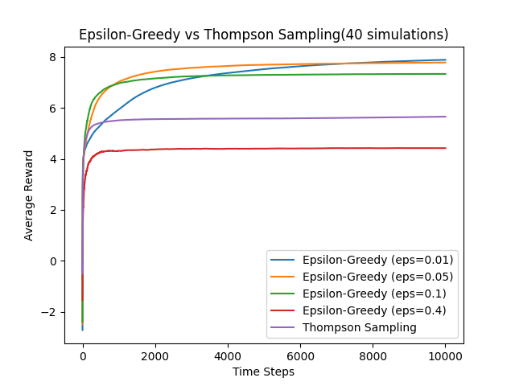
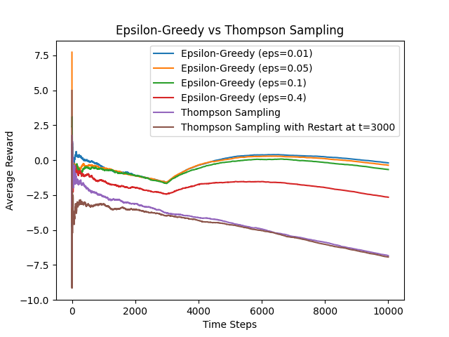

__Code Guide for Running Algorithm__
 
 
Open HW2_Francom_Braxton.py in the IDE of your choice. Click the run button. 
 
 
Open README.md --> You will need to have 'HW2-fig1Final.png', '2.png', '3.png' and 'part2-2.png' in your working directory to correctly see them in the README.
 
 
 

__---------------------------------------------  -  PART 1  -  ---------------------------------------------__
 
 
Below is the plotting of the convergence rate for 10,000 steps for an epsilon-greedy algorithm with epsilon set to 0.01, 0.05, 0.1, 0.4. I found it most helpful to find the average reward measured against time steps going
up to 10,000. This helped me to visualize what was happening with these algorithms.
 
 

 
 
To find the optimal epsilon, I ran my simulation 40 times, and although I do see some variation, epsilon = 0.01 seems to most consistently give the best convergence speed for the 20 options. See below for some example 40 simulation runs:
 

 

 
 
My Thompson Sampling algorithm never amazed me with its performance. In my case, Thompson Sampling has been one of the more poorly performing of the various methods. The average reward the Thompson Sampling algorithm found was usually
significantly lower than most epsilon values in my Epsilon-greedy algorithm.
 
 
 

__---------------------------------------------  -  PART 2  -  ---------------------------------------------__
 
 
Below is the plotting of the convergence rate for 10,000 steps for an epsilon-greedy algorithm with epsilon set to 0.01, 0.05, 0.1, 0.4
where each of the bandits has a drift term where their means are reduced by -0.001 for each time step and there is also several changes in
probability on time step 3,000 as noted in the assignment.
 
 

 
 
 
The optimal epsilon that gives the best convergence speed for these 20 options is most commonly 0.01. Again, there is some variance in my
optimal epsilon, but the best convergence speed is most often given when epsilon = 0.01.
 
 
Observe my implementation of the Thompson sampling method where the means are reduced by -0.001 for each time step in the graph above. It is again near the bottom of the pack as far as performance goes. Given my results, I would almost
always use the epsilon-greedy algorithm over the Thompson Sampling algorithm.
 
 
From my understanding, randomness is the balance between exploration and exploitation. We want a good
balance between exploration and exploitation. When we introduce random elements, the algorithm can explore
new options while also using existing knowledge. If there is no randomness, the algorithm would be 'content' for
lack of a better word and would never explore better alternatives. Too much randomness and the algorithm will waste
time exploring unproductive paths, making it less likely to converge to a good solution within a reasonable time frame.
 
 
Observe the above graph. When I restarted my Thompson sampling algorithm at time=3000, it was not faster than letting it continue to converge. In fact, it kept a nearly identical
trajectory to the thompson sampling without a restart. I believe this is because the algorithm has already converged to a near-optimal solution by time=3000, thus restarting it does
not lead to significantly different results.

