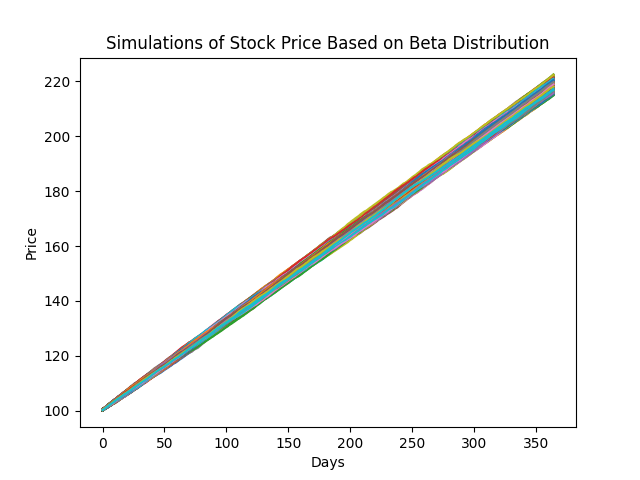
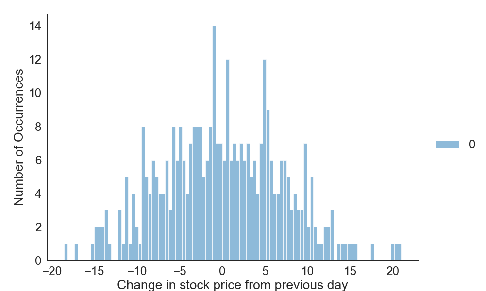
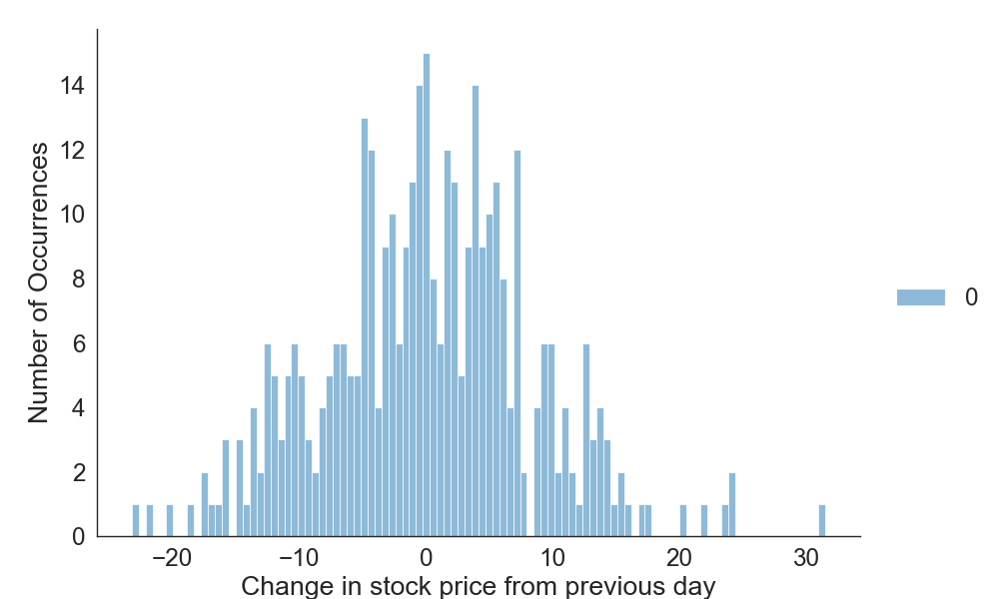
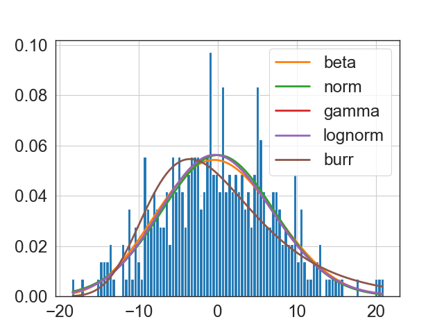
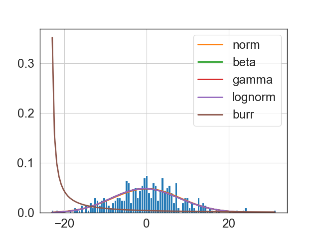
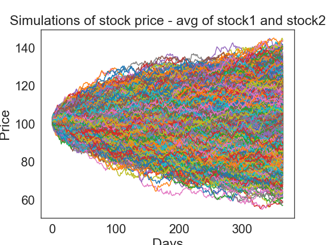
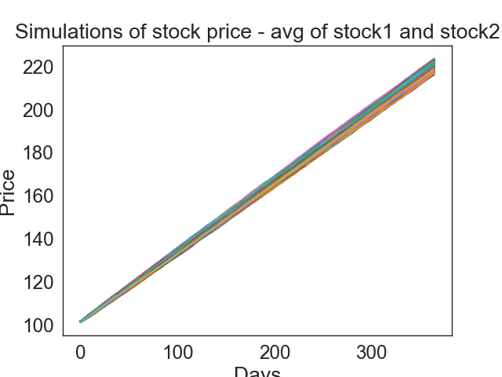
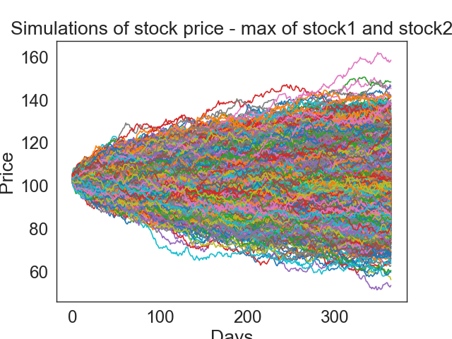
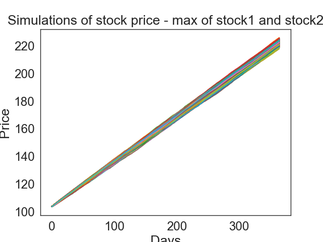

----------------------------------------------------Part 1----------------------------------------------------
 
I created a simulation that runs 5000 monte-carlo simulations around the described asset and returns the effective price. See below image:
  

  
Based on this data, I found the price of the vanilla European Option to be $117.46. 
 
 
 

----------------------------------------------------Part 2----------------------------------------------------

Below is the distribution for `stock1.csv`:
 

  

Below is the distribution for `stock2.csv`:
 

  

I then wanted to see what distribution and parameters gave the best fit for each stock. Below is the analysis for `stock1.csv`:
  

  
The error values for each distribution for `stock1.csv` are as follows:
  
Fitted norm distribution with error=0.012594) 
Fitted beta distribution with error=0.012476) 
Fitted gamma distribution with error=0.012642) 
Fitted lognorm distribution with error=0.012645) 
Fitted burr distribution with error=0.016706) 
 
My findings showed that the distribution that best fit `stock1.csv` was the following:
  
{'beta': {'a': 8.79869504543807, 'b': 11.641039934834343, 'loc': -28.55044529458781, 'scale': 66.35206384896327}}

   

Below is the analysis for `stock2-1.csv`:
  

  
The error values for each distribution for `stock2-1.csv` are as follows:
  
Fitted norm distribution with error=0.010265) 
Fitted gamma distribution with error=0.010431) 
Fitted beta distribution with error=0.010425) 
Fitted lognorm distribution with error=0.010433) 
Fitted burr distribution with error=0.226903) 
 
My findings showed that the distribution that best fit `stock2-1.csv` was the following:
  
{'norm': {'loc': 0.05098900140562429, 'scale': 8.269809581146056}}

   
Based on the analysis conducted on the stock price data from `stock1.csv` and `stock2-1.csv`, I employed the `Fitter` module from the `fitter` library to fit various probability distributions to the observed changes in stock prices. For each dataset, I initially computed the changes in stock prices from one day to the next and then used histograms to visualize the distributions of these changes.
  
I used the `Fitter` module to fit several probability distributions (including gamma, lognormal, beta, Burr, and normal distributions) to the observed data. To determine the goodness of fit, I utilized the sum of squared errors (sumsquare_error) metric.
  
For `stock1.csv`, the best-fitting distribution was identified as the beta distribution, with the following parameters:
- Shape parameter (a): 8.7987
- Shape parameter (b): 11.6410
- Location parameter (loc): -28.5504
- Scale parameter (scale): 66.3521
  
For `stock2-1.csv`, the best-fitting distribution was identified as the normal distribution, with the parameters inferred from the fitted distribution.
  
These distributions and parameters were determined based on the analysis of the observed data and the goodness of fit metrics provided by the `Fitter` module.
   

 
Assuming the same 1-year window of expiry, the cost of option for the average value of the two options is $118.78(using on a beta distribution).
 

 
With a normal distribution, the cost of option is $5.14.(See below)
 

   

Assuming the same 1-year window of expiry, the cost of option for the max value of the two options is $120.82(using on a beta distribution).
 

 
With a normal distribution, the cost of option is $6.11.(See below)
 

