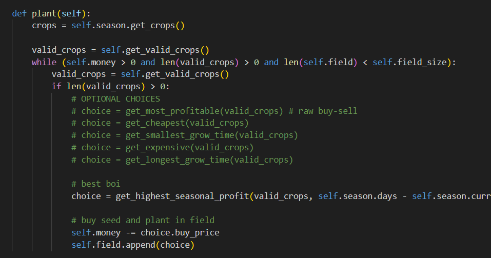

# Crop Scheduling Simulation
This project is a simulation of the farming cyles in the game Stardew Valley. It runs through all three plantable seasons in Stardew with the assumption of it being the first year. Basic money, equipment and energy levels are assumed at the start, with a constant rate of increase to the energy levels to simulate the natural progression of the game. 


## Table of Contents
1. [Set-up](#set-up)
2. [Run Script](#run-script)
3. [Menu Options](#menu-options)
4. [Logic](#logic)
5. [Selecting a Crop](#selecting-a-crop)
6. [Code Structure](#code-structure)


## Set-up

Before running the scheduler, make sure you have the following installed:

- Python 3.x
- Matplotlib
- Seaborn

After installing and setting up python, you can install the needed libraries using pip:
```bash
$ pip install matplotlib seaborn
```
[Download python](https://www.python.org/downloads)

[Matplotlib Docs](https://matplotlib.org/stable/users/installing/index.html)

[Seaborn Docs](https://seaborn.pydata.org/installing.html)


## Run Script

To run the simulation, open a terminal or command prompt and navigate to the project directory. Run the following command:

```bash
$ python scheduler.py
```

This will run the driver program and display a terminal menu to run the simulation.

## Menu Options
The terminal menu has the following options:
> - Run Spring
> - Run Summer
> - Run Fall
> - Run Entire Year

The first 3 options will run the respective season, while the 4th option will run all the seasons back to back in order, carrying over any money from the previous season.

> **NOTE**: The simulation currently runs with the "highest seasonal profit" option selected as the metric to choose new crops to plant. For information on changing the simulation to select new crops to plant based on a different metric, please refer to the [Selecting a Crop](#selecting-a-crop) section of this README.

## Logic
The way this simulation works is as follows:
1. Every day, the farm will "tend" to the field. 
2. The tending action follows these steps:
    - Harvest any plants ready to harvest, update money, clear harvested plants if applicable.
    - Plant new crops if it's a day where the store is open. While money and room on the field is still available, [select a crop](#selecting-a-crop), puchase it and plant it.
    - Water all plants. This action updates the growth on all plants in the field by 1. Once a plant has grown for the specific number of days it needs to grow, it will be ready to harvest.
3. Increment the day count to progress to the next day.
4. Increment total energy by 6, increasing the field size by 3. (Simulates natural game progression)
5. Repeat steps 1-4 until the season is over (28 days for all seasons)
6. If applicable, change out the season by clearing field and logging seasonal gains. Carry over money. Then repeat step 5.

## Selecting a Crop
The scheduling part of this simulation comes from the way the algorithm chooses which plant to plant at any given time. First, all crops available in a season are filtered to just crops that we can afford at that timestep and that can have at least 1 harvest before the season is done. Then, during the planting phase of the tending logic, the Farm object will call on one of the selecting functions to choose a crop from these filtered crops based on various metrics. The choosing functions available are:

- get_most_profitable
- get_smallest_grow_time
- get_longest_grow_time
- get_cheapest
- get_expensive
- get_highest_seasonal_profit

These can be swapped out in the `plant` method of the Farm class. Currently, the code is using the `get_highest_seasonal_profit` function, which selects the crop with the highest potential profit based on the current day in the season. The `get_most_profitable` is similar, but just compares raw buy and sell profit of each plant, with no reference to how far along in the season the simulation is. The rest of the functions are pretty self explanatory. 

If you wish to swap these out and observe the behaviors of selecting a crop based on something other than hgihest seasonal profit, you can go into the `plant` method of the Farm class, comment out the "best boi" choice assignment and uncomment out one of the other options in the "OPTIONAL CHOICES" section:



## Code Structure
The code structure is as follows:

**scheduler.py**: drives the simulation code. Takes user input for the menus. Creates the Farm object which runs the simulation steps.

**farm.py**: contains the Farm class and selecting functions. The Farm class keeps track of the season, days progressed, crops planted, and money for the farm simulation. Contains simulation step methods and tending methods for updating the crops planted. The selecting functions are utilized during the crop 

**season.py**: contains the Season class. This class keeps track of the crops and dates important to a season. Contains methods for checking if a date is a sellable or not sellable day. (Store is closed and/or there is a festival) 

**crop.py**: contains the Crop class. This class keeps track of the meta data for each crop. This includes things like if it's a regrowable plant, the sell and buy prices, grow time, harvest rates, and current amount of grow days. Contains methods to have it increment it's growth and get the value of it's harvest.

> The scheduler contains a Farm. A Farm contains a Season and a field of Crops. A Season contains Crops. A Crop contains meta data.

