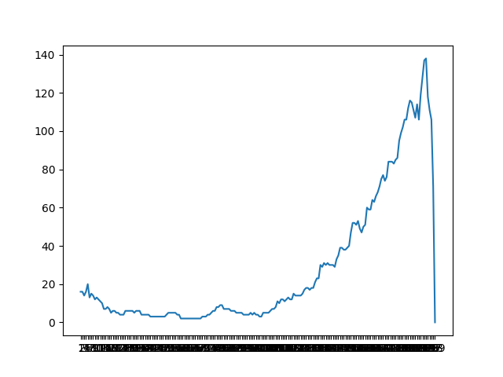

# Optimal Stopping: Stardew Valley Casino Slot Machines

## How to run
Run `python OptimalStopping.py` in either your terminal or IDE. Number of experiment, 
optimal stopping percentage, and accuracy will be shown in the terminal. The graphs for
each test will be shown and saved to the `/imgs` folder

## What is being tested
We want to find the optimal stopping point for playing the slot machines at the stardew
valley casino. To perform this experiment, we needed the percent chances for each winning
outcome and the percent chance of losing. We also needed the rewards for each outcome. The
rewards are as follows:

```
No matching lines: 60% chance with no reward
1 Cherry: 20% chance with multiplier of 2
2 Cherries: 10% chance with multiplier of 3
3 Parsnips: 8% chance with multiplier of 5
3 Milks: 1% chance with multiplier of 30
3 Fish: 0.3% chance with multiplier of 80
3 Shells: 0.2% chance with multiplier of 120
3 Melons: 0.25% chance with multiplier of 200
3 Cherries: 0.09% chance with multiplier of 500
3 Diamonds: 0.06% chance with multiplier of 1000
3 Stardrops: 0.1% chance with multiplier of 2500
```
We then translated these rewards to be used in the
program by setting up a random uniform number generator
with floats from 0 to 100 and assigned the numbers
specific rewards as follows:
``` commandline
0-60.0: no reward
60.0-80.0: amount paid * 2
80.0-90.0: amount paid * 3
90.0-98.0: amount paid * 5
98.0-99.0: amount paid * 30
99.0-99.3: amount paid * 80
99.3-99.5: amount paid * 120
99.5-99.75: amount paid * 200
99.75-99.84: amount paid * 500
99.84-99.9: amount paid * 1000
99.9-100.0: amount paid * 1000
```
The amount paid being either 10 Qi coins or 100 Qi coins or a mix of the two 
throughout the experiment.

The following tests have these commonalities:
* Amount Paid: 10, 100, or mixed (Qi coins)
* Starting Balance: 1000 Qi coins
* Number of games per experiment: 200 rounds
* No luck buffs for the player

## Test 1: Amount Paid is 100 Qi coins every round

Optimal stop of 95%
## Test 2: Amount Paid is 10 Qi coins every round

Optimal stop of 97%
## Test 3: Amount Paid is mixed every round

Optimal stop of 95.5%